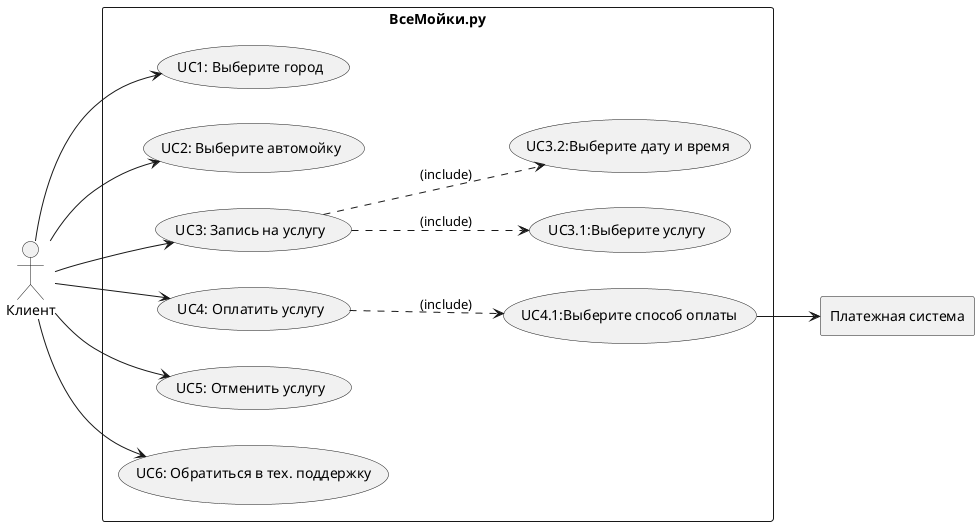
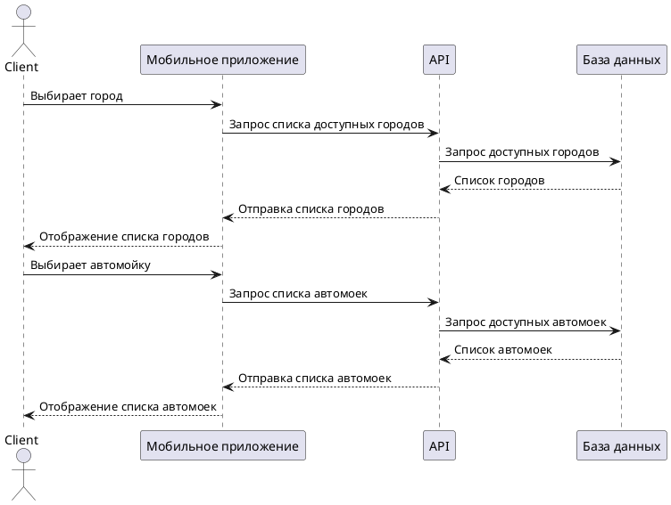
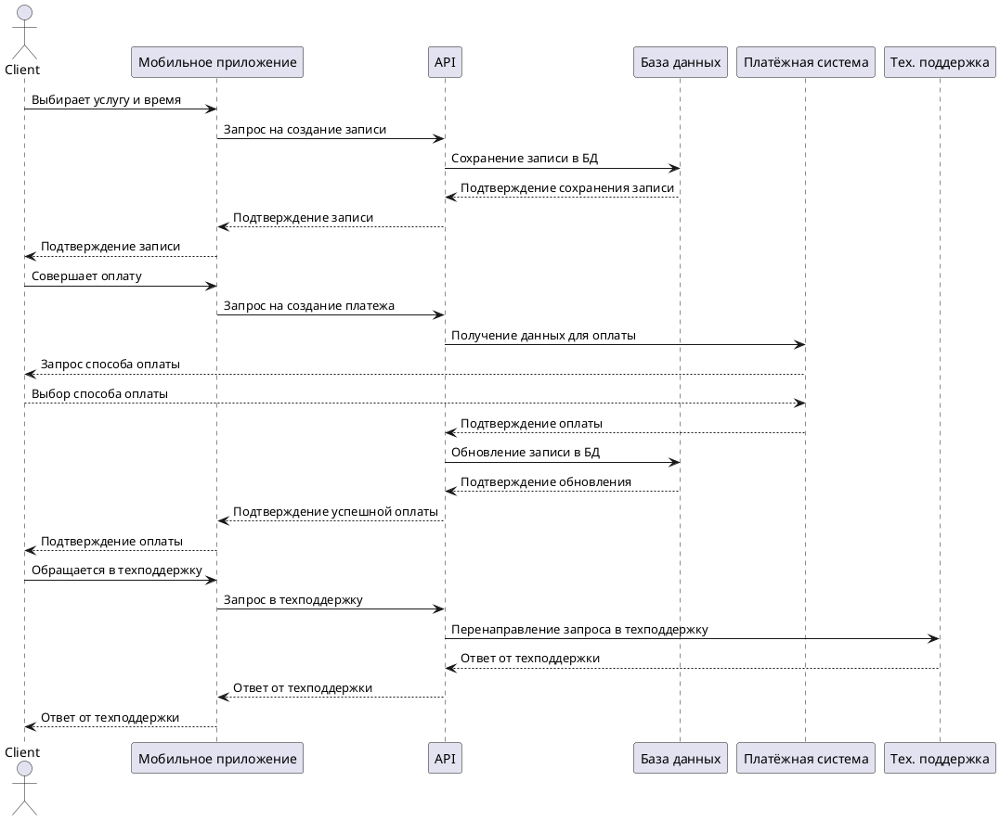
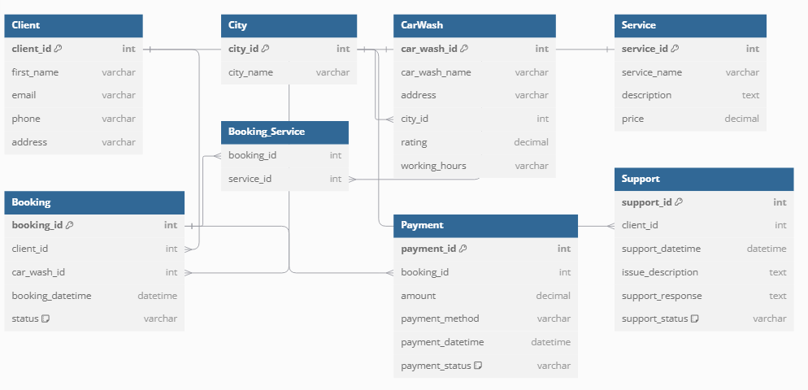
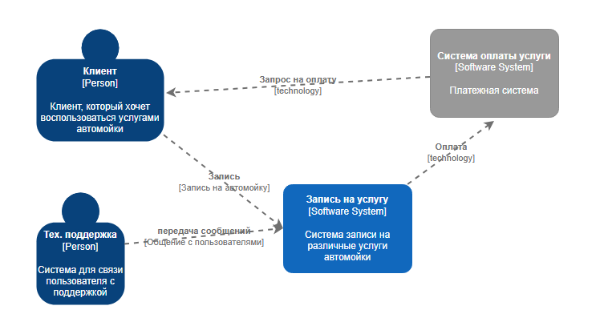

<h2 align="center"><i>Первое задание</i></h2>
<h4 align="center">user stories and usecase</h4>

<p align="center"><i>User stories</i></p>
<h6><b>Я, как , хочу иметь возможность </b></h6>
<ol>
    <li>Я, как отец грудного ребенка, хочу воспользоваться услугой деликатной отмывки сидений от различных пятен, чтобы отмыть хорошо машину.</li>
    <li>Я, как астматик, хочу иметь возможность посидеть в отдельной комнате, чтобы не дышать пылью и грязью</li>
    <li>Я, как бедный студент, хочу иметь возможность получения скидки для определенной категории граждан, чтобы сэкономить деньги </li>
    <li>Я, как владелец большой собаки, хочу иметь возможность в отчистке салона от шерсти, чтобы шерсть не прилеплялась к вещам моих пассажиров.</li>
    <li>Я, как пользователь приложения записи на автомойку, хочу чтобы оно было адаптировано под экран моего устройства, независимо от его размера и форм факторов</li>
    <li>Я, как владелец мопеда, хочу иметь возможность выбора типа транспортного средства, чтобы не переплачивать за услугу</li>
    <li>Я, как клиент, хочу иметь возможность получить уведомление о завершении мойки, чтобы знать когда забрать машину</li>
    <li>Я, как иностранный гражданин, хочу иметь возможность выбора нескольких языков в приложении записи на автомойку, чтобы точно не ошибиться при вводе данных</li>
    <li>Я, как не местный житель, хочу видеть в приложении карту с автомойкой, чтобы без проблем до неё добираться</li>
    <li>Я, как предприниматель, хочу иметь доступ к интернету во время мойки, чтобы не отвлекаться от дел в случае плохого соединения.</li>
</ol>

### <p align="center"><i>Usecase</i></p>


<details>
  <summary>Код Use Case</summary>
  


</details>

### <p><i>Сценарий использования</i></p>

#### UC1: Выберите город
<b>Участники:</b> Клиент<br>
<b>Предусловия:</b> Клиент авторизован в приложении.<br>
<b>Условия для запуска сценария:</b> Клиент переходит в раздел "Запись на мойку" и нажимает на кнопку "Выбрать город".<br>
<b>Признак успешности:</b> Клиент успешно выбрал город.<br><br>
<b>Базовый сценарий:</b>
<ol>
  <li>Система отображает список доступных городов.</li>
  <li>Клиент выбирает нужный город.</li>
  <li>Система отображает список автомоек в выбранном городе.</li>
</ol>
<b>Альтернативный сценарий:</b>
<p><b>Если нужного города нет в списке:</b> Система предлагает пользователю ввести город вручную. Клиент вводит город, и система отображает список автомоек в этом городе.
</p>

#### UC2: Выберите автомойку
<b>Участники:</b> Клиент<br>
<b>Предусловия:</b> Клиент выбрал город.<br>
<b>Условия для запуска сценария:</b> Клиент нажимает на кнопку "Выбрать автомойку" в разделе записи на мойку.<br>
<b>Признак успешности:</b> Клиент успешно выбрал автомойку.<br><br>
<b>Базовый сценарий:</b>
<ol>
  <li>Система отображает список автомоек в выбранном городе.</li>
  <li>Клиент выбирает автомойку.</li>
  <li>Система отображает список услуг, которые предоставляет выбранная автомойка.</li>
</ol>
<b>Альтернативный сценарий:</b>
<p><b>Если геолокация клиента не доступна:</b> Система предлагает разрешить доступ к геолокации, чтобы показать ближайшие автомойки.
</p>
<p><b>Если геолокация не предоставлена:</b> Клиент вводит адрес вручную, и система отображает список автомоек по этому адресу.
</p>

#### UC3: Запись на услугу
<b>Участники:</b> Клиент<br>
<b>Предусловия:</b> Клиент выбрал автомойку.<br>
<b>Условия для запуска сценария:</b>  Клиент нажимает на кнопку "Записаться" для выбора услуги.<br>
<b>Признак успешности:</b> Клиент успешно записался на услугу.<br><br>
<b>Базовый сценарий:</b>
<ol>
  <li>Система отображает список доступных услуг.</li>
  <li>Клиент выбирает услугу.</li>
  <li>Система отображает доступные даты и время для записи.</li>
  <li>Клиент выбирает дату и время.</li>
  <li>Система сохраняет выбранную услугу и дату.</li>
</ol>
<b>Альтернативный сценарий:</b>
<p><b>Если список услуг не доступен:</b> Система отображает сообщение об ошибке и предлагает выбрать другую автомойку.
</p>
<p><b>Если расписание недоступно:</b> Система отображает сообщение об ошибке загрузки календаря и предлагает выбрать другую дату или попробовать позже.
</p>

#### UC4: Оплатить услугу
<b>Участники:</b> Клиент, Платежная система<br>
<b>Предусловия:</b> Клиент выбрал услугу и дату.<br>
<b>Условия для запуска сценария:</b>  Клиент нажимает на кнопку "Оплатить" для завершения записи.<br>
<b>Признак успешности:</b> Клиент успешно оплатил услугу.<br><br>
<b>Базовый сценарий:</b>
<ol>
  <li>Система перенаправляет клиента на страницу оплаты.</li>
  <li>Клиент выбирает способ оплаты (онлайн или наличными).</li>
  <li>Клиент вводит данные для оплаты.</li>
  <li>Платежная система обрабатывает запрос на оплату.</li>
  <li>Клиент подтверждает оплату.</li>
  <li>Платежная система проводит оплату.</li>
  <li>Система отображает сообщение об успешной оплате.</li>
  <li>Система сохраняет статус оплаты и завершает запись.</li>
</ol>
<b>Альтернативный сценарий:</b>
<p><b>Если платёжная система недоступна:</b> Система отображает сообщение об ошибке и предлагает попробовать оплатить позже или выбрать другой способ оплаты.
</p>

#### UC5: Отменить услугу
<b>Участники:</b> Клиент<br>
<b>Предусловия:</b> Клиент записался на услугу.<br>
<b>Условия для запуска сценария:</b>  Клиент нажимает на кнопку "Отменить услугу".<br>
<b>Признак успешности:</b> Клиент успешно отменил услугу.<br><br>
<b>Базовый сценарий:</b>
<ol>
  <li>Система отображает список активных записей клиента.</li>
  <li>Клиент выбирает запись, которую хочет отменить.</li>
  <li>Система запрашивает подтверждение отмены.</li>
  <li>Клиент подтверждает отмену.</li>
  <li>Система обновляет статус записи в базе данных.</li>
  <li>Система отображает сообщение об успешной отмене записи.</li>
</ol>
<b>Альтернативный сценарий:</b>
<p><b>Если статус записи недоступен:</b> Система уведомляет пользователя, что запись не может быть отменена, и предлагает обратиться в техподдержку.
</p>

#### UC6: Обратиться в тех. поддержку
<b>Участники:</b> Клиент<br>
<b>Предусловия:</b> Клиент получил какую-то ошибку<br>
<b>Условия для запуска сценария:</b> Клиент нажимает на кнопку "Обратиться в тех. поддержку"<br>
<b>Признак успешности:</b> Клиент успешно связался с технической поддержкой и решил проблему<br><br>
<b>Базовый сценарий:</b>
<ol>
  <li>Система отображает форму для ввода номера телефона.</li>
  <li>Клиент вводит номер телефона и подтверждает его.</li>
  <li>Система создаёт чат с доступным сотрудником техподдержки.</li>
  <li>Клиент и сотрудник могут обмениваться сообщениями.</li>
</ol>
<b>Альтернативный сценарий:</b>
<p><b>Если нет соединения с Интернетом:</b> Система отображает ошибку соединения и предлагает попробовать позже.
</p>

### <p align="center"><i>Sequence diagram</i></p>

#### 1. Выбор города и автомойки


<details>
  <summary>Код Sequence diagram Выбор города и автомойки</summary>
  


</details>

#### 2. Все остальное (запись на услугу, оплата и обращение в техподдержку)

<details>
  <summary>Код Sequence diagram</summary>
  


</details>

### <p align="center"><i>ERD</i></p>


#### Описание связей между таблицами
1. Клиент - Запись на мойку (Client - Booking). Один клиент может сделать несколько записей на мойку.<br>
Тип связи: (1:M). Один клиент может создать несколько бронирований для различных автомоек или на разные услуги.
2. Запись на мойку - Автомойка (Booking - CarWash). Каждая запись на мойку связана с одной конкретной автомойкой.<br>
Тип связи: (1:1). Каждый заказ на мойку связан с одной автомойкой, на которую клиент записался.
3. Запись на мойку - Услуга (Booking - Booking_Service). Одно бронирование может включать несколько услуг, а одна услуга может быть использована в нескольких записях на мойку.<br>
Тип связи: (M:N) многие ко многим через таблицу Booking_Service. Один клиент может заказать несколько услуг в одном бронировании. Эта связь описана через промежуточную таблицу Booking_Service, которая связывает бронирования с услугами.
4. Услуга - Мойка (Service - CarWash). Одна услуга может быть доступна в нескольких автомойках.<br>
Тип связи: (1:M). Услуга, такая как "мойка" или "полировка", может предлагаться в разных автомойках. Каждая автомойка может предложить несколько услуг.
5. Клиент - Техподдержка (Client - Support). Один клиент может обратиться в техподдержку несколько раз.<br>
Тип связи: (1:M). Один клиент может создать несколько запросов в техподдержку, например, по различным проблемам.
6. Запись на мойку - Платеж (Booking - Payment).
Каждый платеж связан с конкретной записью на мойку.<br>
Тип связи: (1:1). Каждый платёж связан с одним бронированием, подтверждая оплату за конкретную услугу и автомойку.
<details>
  <summary>Код ERD</summary>
  
```plaintext
Table Client {
  client_id int [pk]
  first_name varchar
  email varchar [unique]
  phone varchar
  address varchar
}

Table City {
  city_id int [pk]
  city_name varchar
}

Table CarWash {
  car_wash_id int [pk]
  car_wash_name varchar
  address varchar
  city_id int [ref: > City.city_id]
  rating decimal
  working_hours varchar
}

Table Service {
  service_id int [pk]
  service_name varchar
  description text
  price decimal
}

Table Booking {
  booking_id int [pk]
  client_id int [ref: > Client.client_id]
  car_wash_id int [ref: > CarWash.car_wash_id]
  booking_datetime datetime
  status varchar [default: 'Ожидает']
}

Table Booking_Service {
  booking_id int [ref: > Booking.booking_id]
  service_id int [ref: > Service.service_id]
}

Table Payment {
  payment_id int [pk]
  booking_id int [ref: > Booking.booking_id]
  amount decimal
  payment_method varchar
  payment_datetime datetime
  payment_status varchar [default: 'Ожидает']
}

Table Support {
  support_id int [pk]
  client_id int [ref: > Client.client_id]
  support_datetime datetime
  issue_description text
  support_response text
  support_status varchar [default: 'Ожидает']
}
```

</details>
<hr>
<p align="center"><i>C1 and C2</i></p>


<p align="center"><i>openapi.yaml</i></p>
<p>ToDo:<br>
1. Сделать openapi.yaml в репозитории<br>
2. В openapi.yaml описать:<br>
   - Ручки (ендпоиты для работы с базовыми сущностями)<br> 
   - CRUDL<br>
   - Юзер, Авто, Заказы, Мойки (может что-то еще по выбору)<br>
   - Ручки (ендпоинты) для бизнес-операций<br>
   - Клиент записывается на слот<br>
   - Клиент оплачивает заказ<br>
   - Способы показать ошибки<br>
    </p>
    <details>
  <summary>Код openapi</summary>
  
```plaintext
openapi: 3.0.0
info:
  title: "API услуги автомойки"
  description: "API для системы записи на автомойку"
  version: "0.1"

servers:
  - url: http://localhost:8080/api/v1
    description: "server API"

paths:
  /clients:
    get:
      summary: "Получить список клиентов"
      description: "Метод, возвращающий список всех клиентов"
      responses:
        "200":
          description: "Успешный ответ со списком клиентов"
          content:
            application/json:
              schema:
                type: array
                items:
                  $ref: '#/components/schemas/Client'
        "default":
          description: "Ошибки"
          content:
            application/json:
              schema:
                $ref: "#/components/schemas/Error"
    post:
      summary: "Создать клиента"
      description: "Метод, создающий нового клиента"
      requestBody:
        required: true
        content:
          application/json:
            schema:
              $ref: '#/components/schemas/Client'
      responses:
        "201":
          description: "Клиент успешно создан"
        "default":
          description: "Ошибки"
          content:
            application/json:
              schema:
                $ref: "#/components/schemas/Error"  
  /clients/{clientId}:
    get:
      summary: "Получить клиента по ID"
      parameters:
        - name: clientId
          in: path
          required: true
          description: "Идентификатор клиента"
          schema:
            type: integer
          example: 1
      responses:
        "200":
          description: "Успешный ответ с информацией о клиенте"
          content:
            application/json:
              schema:
                $ref: '#/components/schemas/Client'
        "404":
          description: Клиент не найден
    put:
      summary: "Обновить клиента"
      parameters:
        - name: clientId
          in: path
          required: true
          schema:
            type: integer
      requestBody:
        required: true
        content:
          application/json:
            schema:
              $ref: '#/components/schemas/Client'
      responses:
        "200":
          description: "Клиент успешно обновлен"
    delete:
      summary: "Удалить клиента"
      parameters:
        - name: clientId
          in: path
          required: true
          schema:
            type: integer
      responses:
        '204':
          description: "Клиент был удален"

  /bookings:
    get:
      summary: "Получить список заказов"
      responses:
        "200":
          description: "Список заказов"
          content:
            application/json:
              schema:
                type: array
                items:
                  $ref: '#/components/schemas/Booking'
    post:
      summary: "Создать заказ"
      requestBody:
        required: true
        content:
          application/json:
            schema:
              $ref: '#/components/schemas/Booking'
      responses:
        "201":
          description: "Заказ был создан"

  /bookings/{bookingId}/reserve:
    post:
      summary: "Клиент записывается на слот"
      description: "Метод бронирования слота для клиента"
      parameters:
        - name: bookingId
          in: path
          required: true
          schema:
            type: integer
      responses:
        "200":
          description: "Слот успешно забронирован"
        "400":
          description: "Невозможно забронировать слот"
        "404":
          description: "Заказ не найден"

  /bookings/{bookingId}/pay:
    post:
      summary: "Клиент оплачивает заказ"
      description: "Оплата заказа клиентом"
      parameters:
        - name: bookingId
          in: path
          required: true
          schema:
            type: integer
      requestBody:
        required: true
        content:
          application/json:
            schema:
              type: object
              properties:
                payment_method:
                  type: string
      responses:
        "200":
          description: "Оплата успешно выполнена"
        "400":
          description: "Ошибка при оплате"
        "404":
          description: "Заказ не был найден"

  /support:
    post:
      summary: "Отправка запроса в тех. поддержку"
      description: "Клиент отправляет запрос в тех. поддержку"
      requestBody:
        required: true
        content:
          application/json:
            schema:
              $ref: '#/components/schemas/Support'
      responses:
        "200":
          description: "Запрос успешно отправлен"

components:
  schemas:
    Client:
      type: object
      properties:
        client_id:
          type: integer
        first_name:
          type: string
        email:
          type: string
        phone:
          type: string

    Booking:
      type: object
      properties:
        booking_id:
          type: integer
        client_id:
          type: integer
        car_wash_id:
          type: integer
        booking_datetime:
          type: string
          format: date-time
        status:
          type: string
          enum: [Ожидает, Подтвержден, Завершен]

    Support:
      type: object
      properties:
        support_id:
          type: integer
        client_id:
          type: integer
        issue_description:
          type: string
        support_status:
          type: string
          enum: [Ожидает, В процессе, Закрыт]

    Error:
      type: object
      properties:
        code:
          type: integer
        message:
          type: string

```

</details>